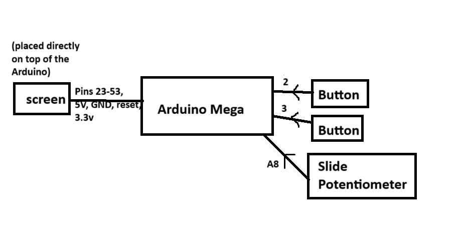
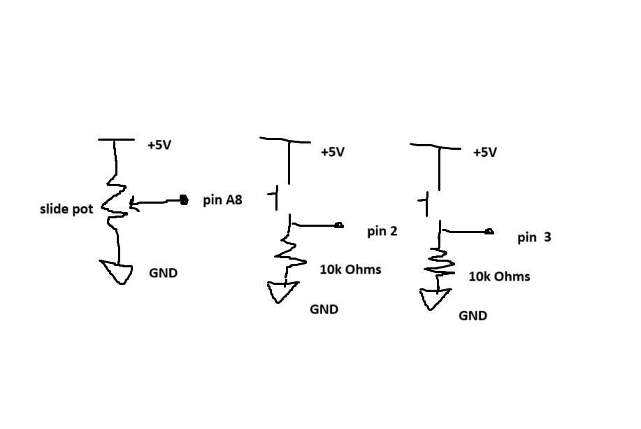

## Handheld Arduino Game
A handheld game prototype developed as my final project for CMU's 18-095: Getting Started in Electronics.

## Oveview
As an exploration into non-traditional input systems, this Arduino project uses a slide potentiometer to control the player's vertical position. The game itself is inspired by Flappy Bird.

## Features
- Score and High Score systems
- Customizable player colors

## Hardware
- Arduino Mega
- [3.5" LCD Screen](https://www.amazon.com/HiLetgo-Display-ILI9481-480X320-Mega2560/dp/B073R7Q8FF)
- [Slide Potentiometer](https://www.sparkfun.com/slide-pot-medium-10k-linear-taper.html)
- Buttons

## Setup
- I downloaded the TFT_HX8357 library from [github.com/Bodmer/TFT_HX8357](https://github.com/Bodmer/TFT_HX8357) and customized according to the instructions in User_Setup.h according to my specific LCD Screen.
- I've included my customized library file as part of this repo.

## Schematics and Diagrams

## Media
