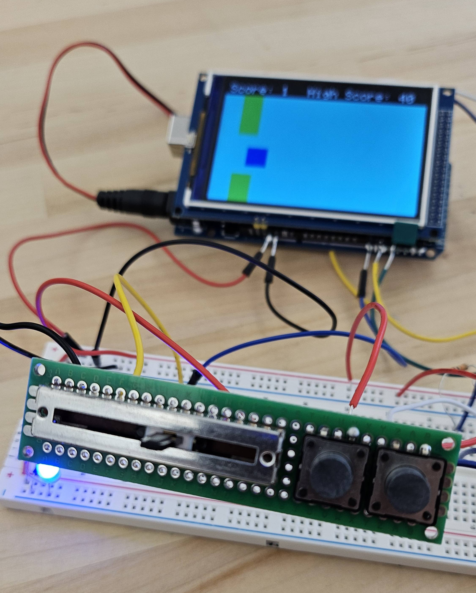
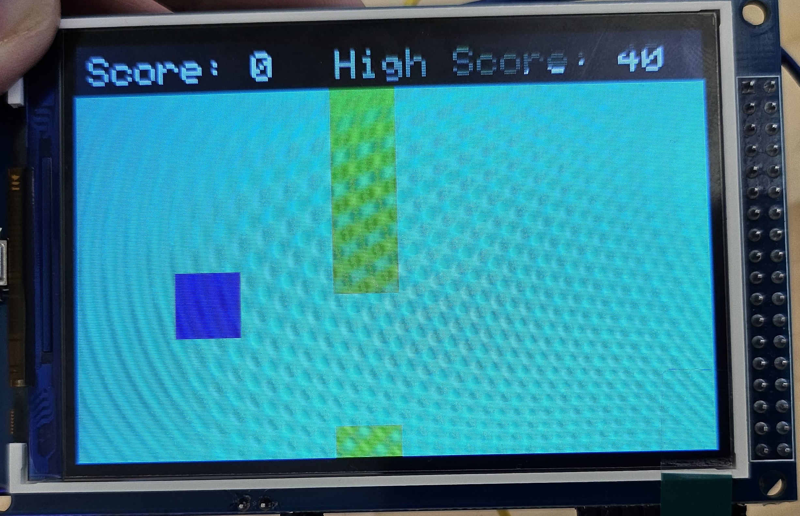

## Handheld Arduino Game
This handheld game prototype was developed as my final project for CMU's 18-095: Getting Started in Electronics.

## Overview
This project explores non-traditional tactile input systems by using a slide potentiometer to control the player's vertical position. The game itself is inspired by Flappy Bird.

## Features
- Score and High Score systems
- Customizable player colors

## Hardware
- Arduino Mega
- [3.5" LCD Screen](https://www.amazon.com/HiLetgo-Display-ILI9481-480X320-Mega2560/dp/B073R7Q8FF)
- [Slide Potentiometer](https://www.sparkfun.com/slide-pot-medium-10k-linear-taper.html)
- Buttons

## Setup
- Download the `TFT_HX8357` library from [github.com/Bodmer/TFT_HX8357](https://github.com/Bodmer/TFT_HX8357)
- Customize `User_Setup.h` according to your specific screen model (instructions are found in the repo)
- I've included my customized library file for reference.

## Media
This is the overall system, including the screen and the controller.

This is a closer look at the screen.

## Schematics and Diagrams
This is a block diagram of the Arduino pins.

This is a schematic for the electrical components.

